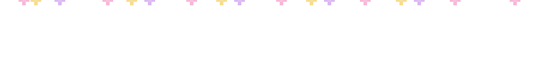
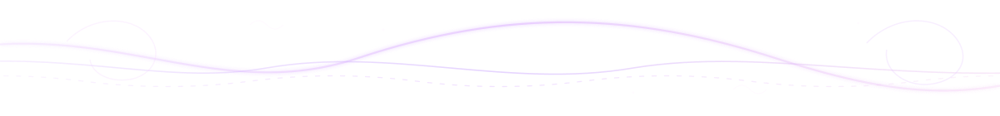

# Hafsa Imtiaz
<h3><strong>Computer Science</strong> · <strong>Multi‑Agent Systems</strong> · <strong>Fine-tuning</strong> · <strong>Applied ML</strong></h3>

 

<strong>Languages</strong>

  

<strong>AI / ML</strong>

  

  
  
  
  
  

<strong>Frameworks &amp; Tools</strong>

  

 

&nbsp;

&nbsp;

&nbsp;

  

